Google Store Transaction Revenue Prediction
================
Seyoung Jung
7/31/2020

-----

# 1 Introduction

As we all know, Google is one of the biggest tech giants. They
specialize in internet-related services, and people all around the world
use them on a daily basis. Having billions of active users allows them
to accumulate massive data, which plays a critical role of further
developing their businesses rapidly.

Not only internet-related services, Google operates Google Store (GStore
in short) which is an online retailer that sells not only hardwares
including phones, Chromecasts, and speakers, but also accessories such
as chargers, earbuds, etc. You can explore GStore
[here](https://store.google.com/).

In this project, we build a model that predicts transaction revenues
from each visitors. We build XGBoost and LightGBM models. The dataset
used for this project can be found
[here](https://www.kaggle.com/c/ga-customer-revenue-prediction). The
third chapter describes how the dataset looks like. You will see that
our target variable, transactionRevenue, is a million times of USD. The
dataset contains JSON formatted columns.If you parse the columns, we get
55 variables including pageviews, bounce, sessionId, etc. They provide
two sets of csv files: training set with target variables
(transactionRevenue) and test set without target variables. However, in
this project, we use only training set to see how well our model
predicts transaction revenues.

-----

# 2 Preparation

First, let’s load libraries that we are going to use for this project.

``` r
library(readr)        
library(dplyr)       
library(stringr)      
library(ggplot2)      
library(scales)       
library(gridExtra)    
library(tidyr)
library(jsonlite)     
library(Hmisc)        
library(lubridate)
library(forcats)
library(magrittr)    
library(janitor)      
library(lightgbm)
library(xgboost)
library(caret)
library(Matrix)
```

And then load the dataset to analyze.

``` r
GA_data <- read_csv("train_v1.csv", n_max=1000000)
```

Since the dataset contains JSON columns (device, geoNetwork, totals, and
trafficSource), we are going to parse them and remove the original
columns. And then we will combine the new dataset with the original
dataset.

``` r
device_df <- paste("[", paste(GA_data$device, collapse = ","), "]") %>% fromJSON(flatten = T)
geoNetwork_df <- paste("[", paste(GA_data$geoNetwork, collapse = ","), "]") %>% fromJSON(flatten = T)
totals_df <- paste("[", paste(GA_data$totals, collapse = ","), "]") %>% fromJSON(flatten = T)
trafficSource_df <- paste("[", paste(GA_data$trafficSource, collapse = ","), "]") %>% fromJSON(flatten = T)

GA_data <- GA_data[, -c(3, 5, 8, 9)]
GA_combined <- cbind(GA_data, device_df, geoNetwork_df, totals_df, trafficSource_df)
rm(device_df, geoNetwork_df, totals_df, trafficSource_df)
```

Let’s have a glimpse of the structure of the dataset. Below we can see
that most of features are character features and a lot of them have
constant data.

``` r
glimpse(GA_combined)
```

    ## Rows: 903,653
    ## Columns: 55
    ## $ channelGrouping                     <chr> "Organic Search", "Organic Sear...
    ## $ date                                <dbl> 20160902, 20160902, 20160902, 2...
    ## $ fullVisitorId                       <chr> "1131660440785968503", "3773060...
    ## $ sessionId                           <chr> "1131660440785968503_1472830385...
    ## $ socialEngagementType                <chr> "Not Socially Engaged", "Not So...
    ## $ visitId                             <dbl> 1472830385, 1472880147, 1472865...
    ## $ visitNumber                         <dbl> 1, 1, 1, 1, 2, 1, 1, 1, 1, 1, 1...
    ## $ visitStartTime                      <dbl> 1472830385, 1472880147, 1472865...
    ## $ browser                             <chr> "Chrome", "Firefox", "Chrome", ...
    ## $ browserVersion                      <chr> "not available in demo dataset"...
    ## $ browserSize                         <chr> "not available in demo dataset"...
    ## $ operatingSystem                     <chr> "Windows", "Macintosh", "Window...
    ## $ operatingSystemVersion              <chr> "not available in demo dataset"...
    ## $ isMobile                            <lgl> FALSE, FALSE, FALSE, FALSE, TRU...
    ## $ mobileDeviceBranding                <chr> "not available in demo dataset"...
    ## $ mobileDeviceModel                   <chr> "not available in demo dataset"...
    ## $ mobileInputSelector                 <chr> "not available in demo dataset"...
    ## $ mobileDeviceInfo                    <chr> "not available in demo dataset"...
    ## $ mobileDeviceMarketingName           <chr> "not available in demo dataset"...
    ## $ flashVersion                        <chr> "not available in demo dataset"...
    ## $ language                            <chr> "not available in demo dataset"...
    ## $ screenColors                        <chr> "not available in demo dataset"...
    ## $ screenResolution                    <chr> "not available in demo dataset"...
    ## $ deviceCategory                      <chr> "desktop", "desktop", "desktop"...
    ## $ continent                           <chr> "Asia", "Oceania", "Europe", "A...
    ## $ subContinent                        <chr> "Western Asia", "Australasia", ...
    ## $ country                             <chr> "Turkey", "Australia", "Spain",...
    ## $ region                              <chr> "Izmir", "not available in demo...
    ## $ metro                               <chr> "(not set)", "not available in ...
    ## $ city                                <chr> "Izmir", "not available in demo...
    ## $ cityId                              <chr> "not available in demo dataset"...
    ## $ networkDomain                       <chr> "ttnet.com.tr", "dodo.net.au", ...
    ## $ latitude                            <chr> "not available in demo dataset"...
    ## $ longitude                           <chr> "not available in demo dataset"...
    ## $ networkLocation                     <chr> "not available in demo dataset"...
    ## $ visits                              <chr> "1", "1", "1", "1", "1", "1", "...
    ## $ hits                                <chr> "1", "1", "1", "1", "1", "1", "...
    ## $ pageviews                           <chr> "1", "1", "1", "1", "1", "1", "...
    ## $ bounces                             <chr> "1", "1", "1", "1", "1", "1", "...
    ## $ newVisits                           <chr> "1", "1", "1", "1", NA, "1", "1...
    ## $ transactionRevenue                  <chr> NA, NA, NA, NA, NA, NA, NA, NA,...
    ## $ campaign                            <chr> "(not set)", "(not set)", "(not...
    ## $ source                              <chr> "google", "google", "google", "...
    ## $ medium                              <chr> "organic", "organic", "organic"...
    ## $ keyword                             <chr> "(not provided)", "(not provide...
    ## $ isTrueDirect                        <lgl> NA, NA, NA, NA, TRUE, NA, NA, N...
    ## $ referralPath                        <chr> NA, NA, NA, NA, NA, NA, NA, NA,...
    ## $ adContent                           <chr> NA, NA, NA, NA, NA, NA, NA, NA,...
    ## $ campaignCode                        <chr> NA, NA, NA, NA, NA, NA, NA, NA,...
    ## $ adwordsClickInfo.criteriaParameters <chr> "not available in demo dataset"...
    ## $ adwordsClickInfo.page               <chr> NA, NA, NA, NA, NA, NA, NA, NA,...
    ## $ adwordsClickInfo.slot               <chr> NA, NA, NA, NA, NA, NA, NA, NA,...
    ## $ adwordsClickInfo.gclId              <chr> NA, NA, NA, NA, NA, NA, NA, NA,...
    ## $ adwordsClickInfo.adNetworkType      <chr> NA, NA, NA, NA, NA, NA, NA, NA,...
    ## $ adwordsClickInfo.isVideoAd          <lgl> NA, NA, NA, NA, NA, NA, NA, NA,...

We will remove constant features, because they will not be useful to our
predictive model.

``` r
nonconstant_data <- remove_constant(GA_combined, na.rm = FALSE, quiet = TRUE)
removed_columns <- setdiff(names(GA_combined), names(nonconstant_data))
paste0(length(removed_columns), " features have been removed")
```

    ## [1] "19 features have been removed"

We have 6 different types of missing values in this dataset; “(not
set)”, “not available in demo dataset”, “(not provided)”, “(none)”,
“unknown.unknown”, and “<NA>”. We will replace them with “<NA>”.

``` r
missingvals <- function(x) x %in% c("(not set)", "not available in demo dataset", "(not provided)", "(none)", "unknown.unknown", "<NA>")

nonconstant_data %<>% mutate_all(funs(ifelse(missingvals(.), NA, .)))
```

The ratios of NA’s in each feature from the dataset are as follows. You
can see that approximately 98.73% of our target variable,
transactionRevenue, is missing. It means that 1.27% of visits had
transaction revenues.

``` r
options(scipen = 999) 
NA_columns <- sapply(nonconstant_data, function(x) {sum(is.na(x))/length(x)})
NA_columns[order(-NA_columns)]  %>% head(26) 
```

    ##                   campaignCode                      adContent 
    ##                 0.999998893381                 0.987886943329 
    ##             transactionRevenue          adwordsClickInfo.page 
    ##                 0.987257276853                 0.976251946267 
    ##          adwordsClickInfo.slot adwordsClickInfo.adNetworkType 
    ##                 0.976251946267                 0.976251946267 
    ##     adwordsClickInfo.isVideoAd         adwordsClickInfo.gclId 
    ##                 0.976251946267                 0.976140177701 
    ##                        keyword                       campaign 
    ##                 0.961975448541                 0.957609834749 
    ##                          metro                   isTrueDirect 
    ##                 0.785694287520                 0.696780733312 
    ##                   referralPath                           city 
    ##                 0.633774247416                 0.600331100544 
    ##                         region                        bounces 
    ##                 0.593210004283                 0.501324070191 
    ##                  networkDomain                      newVisits 
    ##                 0.432594148418                 0.221980118475 
    ##                         medium                operatingSystem 
    ##                 0.158408150031                 0.005195578391 
    ##                      continent                   subContinent 
    ##                 0.001624517376                 0.001624517376 
    ##                        country                      pageviews 
    ##                 0.001624517376                 0.000110661947 
    ##                         source                        browser 
    ##                 0.000076356743                 0.000008852956

Next, we will convert variables accordingly.

``` r
nonconstant_data$date <- ymd(nonconstant_data$date)
cols_toFactor <- c("channelGrouping", "browser", "operatingSystem", "deviceCategory", "continent", "medium")
nonconstant_data %<>% mutate_each_(funs(factor(.)),cols_toFactor)
cols_toNumeric <- c("hits", "pageviews", "transactionRevenue")
nonconstant_data %<>% mutate_each_(funs(as.numeric),cols_toNumeric)
```

We can calculate the USD ($) by dividing transactionRevenue by 1
million. We will create a new feature “USD” and add it to our dataset.

``` r
nonconstant_data$USD <- nonconstant_data$transactionRevenue/10^6
```

Data sampling (75%: Training set / 25%: Test set)

``` r
sample_size <- floor(0.75 * nrow(nonconstant_data))
set.seed(209)
sampling_data <- sample(seq_len(nrow(nonconstant_data)), size = sample_size)
train_set <- nonconstant_data[sampling_data, ]
test_set <- nonconstant_data[-sampling_data, ]
paste0("The training set has ", nrow(train_set), " sessions, and the test set has ", nrow(test_set), " sessions")
```

    ## [1] "The training set has 677739 sessions, and the test set has 225914 sessions"

-----

# 3 Exploratory Data Analysis

In this section, we will investigate on our data to understand how it
looks like and find patterns using various methods such as
visualizations. Feature names explained below are excerpted from
[here](https://support.google.com/analytics/answer/3437719?hl=en)

  - **channelGrouping**: The Default Channel Group associated with an
    end user’s session for this View.
  - **date**: The date of the session in YYYYMMDD format.
  - **fullVisitorId**:The unique visitor ID (also known as client ID).
  - **sessionId**: A unique identifier for this visit to the store.
  - **visitId**: An identifier for this session. This is part of the
    value usually stored as the \_utmb cookie. This is only unique to
    the user. For a completely unique ID, you should use a combination
    of fullVisitorId and visitId.
  - **visitNumber**: The session number for this user. If this is the
    first session, then this is set to 1.
  - **visitStartTime**: The timestamp (expressed as POSIX time).
  - **browser**: The browser used (e.g., “Chrome” or “Firefox”).
  - **operatingSystem**: The operating system of the device (e.g.,
    “Macintosh” or “Windows”).
  - **isMobile**: If the user is on a mobile device, this value is true,
    otherwise false.
  - **deviceCategory**: The type of device (Mobile, Tablet, Desktop).
  - **continent**: The continent from which sessions originated, based
    on IP address.
  - **subContinent**: The sub-continent from which sessions originated,
    based on IP address of the visitor.
  - **country**: The country from which sessions originated, based on IP
    address.
  - **region**: The region from which sessions originate, derived from
    IP addresses. In the U.S., a region is a state, such as New York.
  - **metro**: The Designated Market Area (DMA) from which sessions
    originate.
  - **city**: Users’ city, derived from their IP addresses or
    Geographical IDs.
  - **networkDomain**: The domain name of user’s ISP, derived from the
    domain name registered to the ISP’s IP address.
  - **hits**: This row and nested fields are populated for any and all
    types of hits.
  - **pageviews**: Total number of pageviews within the session.
  - **bounces**: Total bounces (for convenience). For a bounced session,
    the value is 1, otherwise it is null.
  - **newVisits**: Total number of new users in session (for
    convenience). If this is the first visit, this value is 1, otherwise
    it is null.
  - **transactionRevenue**: Total transaction revenue, expressed as the
    value passed to Analytics multiplied by 10^6 (e.g., 2.40 would be
    given as 2400000).
  - **campaign**: The campaign value. Usually set by the utm\_campaign
    URL parameter.
  - **source**: The source of the traffic source. Could be the name of
    the search engine, the referring hostname, or a value of the
    utm\_source URL parameter.
  - **medium**: The medium of the traffic source. Could be “organic”,
    “cpc”, “referral”, or the value of the utm\_medium URL parameter.
  - **keyword**: The keyword of the traffic source, usually set when the
    trafficSource.medium is “organic” or “cpc”. Can be set by the
    utm\_term URL parameter.
  - **isTrueDirect**: True if the source of the session was Direct
    (meaning the user typed the name of your website URL into the
    browser or came to your site via a bookmark), This field will also
    be true if 2 successive but distinct sessions have exactly the same
    campaign details. Otherwise NULL.
  - **referralPath**: If trafficSource.medium is “referral”, then this
    is set to the path of the referrer. (The host name of the referrer
    is in trafficSource.source.)
  - **adContent**: The ad content of the traffic source. Can be set by
    the utm\_content URL parameter.
  - **campaignCode**: Value of the utm\_id campaign tracking parameter,
    used for manual campaign tracking.
  - **adwordsClickInfo.page**: Page number in search results where the
    ad was shown.
  - **adwordsClickInfo.slot**: Position of the Ad. Takes one of the
    following values:{“RHS”, “Top”}
  - **adwordsClickInfo.gclId**: The Google Click ID.
  - **adwordsClickInfo.adNetworkType**: Network Type. Takes one of the
    following values: {“Google Search”, “Content”, “Search partners”,
    “Ad Exchange”, “Yahoo Japan Search”, “Yahoo Japan AFS”, “unknown”}
  - **adwordsClickInfo.isVideoAd**: True if it is a Trueview video ad.

### Transaction Revenue

As we have observed earlier, roughly 98% of this feature is missing. We
can interpret these “missing values” as non-revenue. Hence, we will
substitute NA with the value 0.

``` r
train_TR_na <- is.na(train_set$transactionRevenue)
train_set$transactionRevenue[train_TR_na] <- 0
train_set$USD[train_TR_na] <- 0

test_TR_na <- is.na(test_set$transactionRevenue)
test_set$transactionRevenue[test_TR_na] <- 0
test_set$USD[test_TR_na] <- 0
```

``` r
revenue_positive <- which(train_set$transactionRevenue != 0)
paste0("Among the ", nrow(train_set), " sessions in the training set, ", length(revenue_positive), " of them had revenues.")   
```

    ## [1] "Among the 677739 sessions in the training set, 8570 of them had revenues."

``` r
summary(train_set$transactionRevenue[revenue_positive] / 10^6)
```

    ##     Min.  1st Qu.   Median     Mean  3rd Qu.     Max. 
    ##     0.01    24.52    49.28   135.03   108.34 23129.50

We can see that the max is much higher than the 3rd quartile. We can
suspect that few sessions had extremely high transaction revenues.

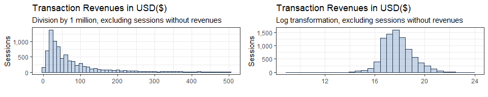<!-- --> When the original
values are divided by a million to make them in USD, plot is right
skewed and centered around $50. But the plot of log transformed values
seems quite normally distributed, and it is centered around 17.5.

### Channels

``` r
paste0("There are ", length(unique(train_set$channelGrouping)), " different channels in the dataset. Among the channels, ", length(unique(train_set$channelGrouping[revenue_positive])), " channels were related to transactions")
```

    ## [1] "There are 8 different channels in the dataset. Among the channels, 7 channels were related to transactions"

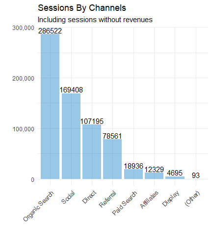<!-- -->

    ## # A tibble: 8 x 5
    ##   channelGrouping  Count Percentage  TotRev  AveRev
    ##   <fct>            <int>      <dbl>   <dbl>   <dbl>
    ## 1 Organic Search  286522    42.3    246528.  0.860 
    ## 2 Social          169408    25.0      3189.  0.0188
    ## 3 Direct          107195    15.8    333654.  3.11  
    ## 4 Referral         78561    11.6    487659.  6.21  
    ## 5 Paid Search      18936     2.79    31818.  1.68  
    ## 6 Affiliates       12329     1.82      523.  0.0424
    ## 7 Display           4695     0.693   53807. 11.5   
    ## 8 (Other)             93     0.0137      0   0

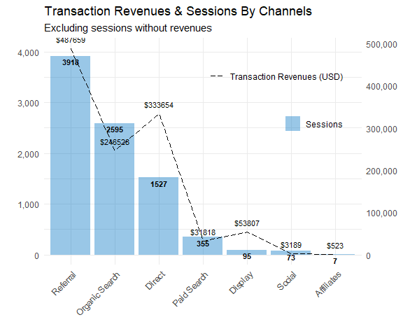<!-- -->

    ## # A tibble: 7 x 5
    ##   channelGrouping Count Percentage  TotRev AveRev
    ##   <fct>           <int>      <dbl>   <dbl>  <dbl>
    ## 1 Referral         3918    45.7    487659.  124. 
    ## 2 Organic Search   2595    30.3    246528.   95.0
    ## 3 Direct           1527    17.8    333654.  219. 
    ## 4 Paid Search       355     4.14    31818.   89.6
    ## 5 Display            95     1.11    53807.  566. 
    ## 6 Social             73     0.852    3189.   43.7
    ## 7 Affiliates          7     0.0817    523.   74.7

The two tables tell us that the proportion of same channels differ based
on whether they are from the original dataset or dataset which contains
only positive transanction revenues. For instance, in the new dataset,
“Other” category has 0%, significantly lower percentage of
“Affiliates” and “Social”, etc.

### Date

``` r
paste0("The date ranges from ", min(train_set$date), " to ", max(train_set$date))
```

    ## [1] "The date ranges from 2016-08-01 to 2017-08-01"

Now, we will get days, weekdays, months, years from the “date”

``` r
train_set$day <- day(train_set$date)
test_set$day <- day(test_set$date)

train_set$DayoftheWeek <- wday(train_set$date, label = TRUE, abbr = FALSE)
test_set$DayoftheWeek <- wday(test_set$date, label = TRUE, abbr = FALSE)

train_set$month <- month(train_set$date, label=TRUE, abbr = FALSE)
test_set$month <- month(test_set$date, label=TRUE, abbr = FALSE)

train_set$year <- year(train_set$date)
test_set$year <- year(test_set$date)
```

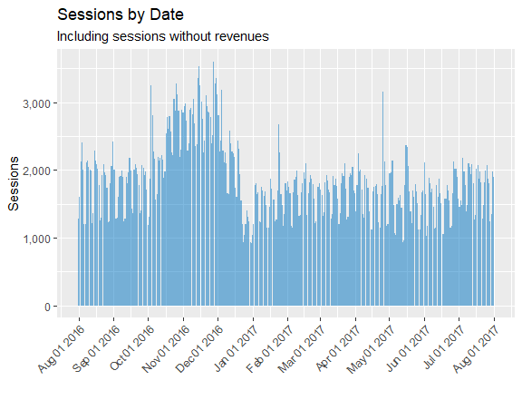<!-- -->

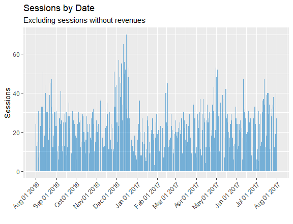<!-- -->

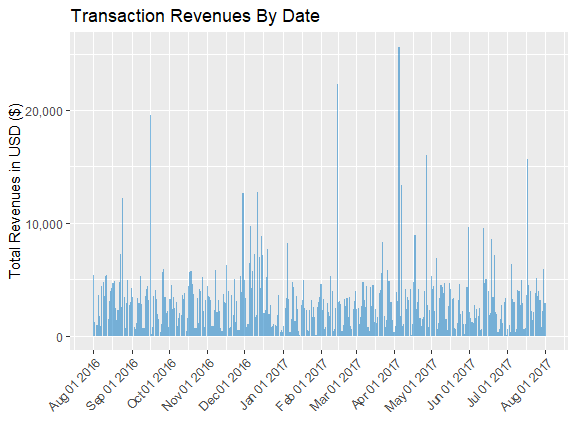<!-- -->

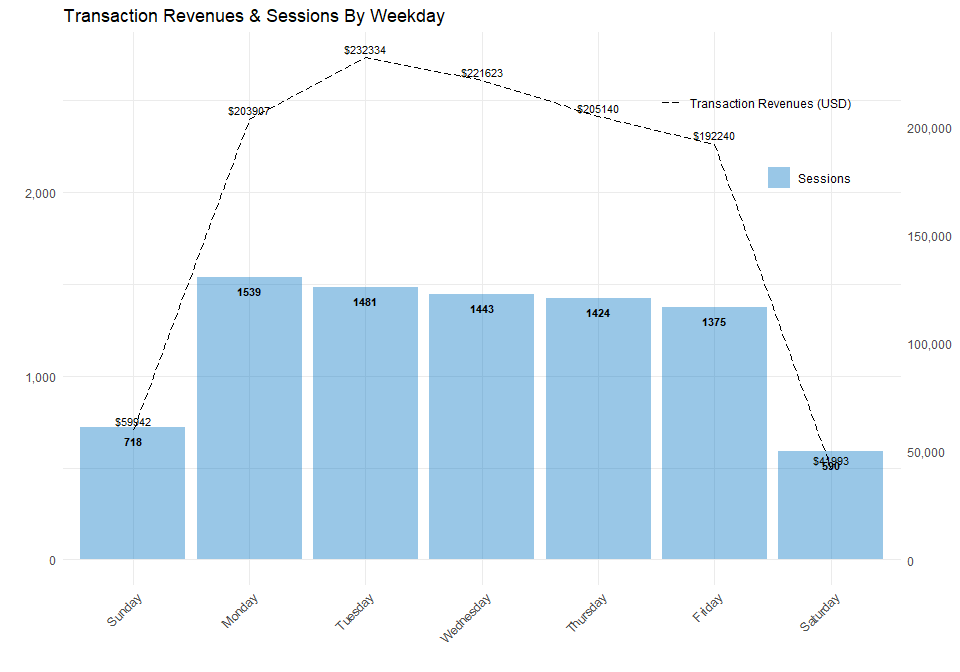<!-- --> Generally, we
might assume that people will go online shopping on weekends more often
than weekdays. However, this plot shows us that the weekends are as low
as only half of weekdays. We can infer that, since GStore sells mostly
company-related products, transactions are occurred during business
hours on weekdays.

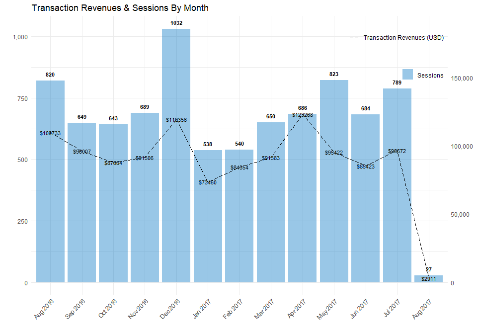<!-- -->

Interestingly, there was the highest transaction revenues in April 2017,
even though the month has only the 5th highest number of sessions. We
can suspect that the outliers from the transactionRevenue belong to the
month.

### ID

There are three types of ID’s in this dataset: fullVisitorId, visitId,
and sessionId

``` r
head(train_set$fullVisitorId, 5)
```

    ## [1] "7836989256739047957" "6771216666510153174" "3291239470890421549"
    ## [4] "4222581971591833582" "3393811512957216502"

``` r
head(train_set$visitId, 5)   
```

    ## [1] 1486445665 1489526727 1484693550 1486321727 1501127327

``` r
head(train_set$sessionId, 5)         
```

    ## [1] "7836989256739047957_1486445665" "6771216666510153174_1489526727"
    ## [3] "3291239470890421549_1484693550" "4222581971591833582_1486321727"
    ## [5] "3393811512957216502_1501127327"

We can see that sessionId is a combination of fullVisitorId and visitId.

``` r
dup_sessionId <- which(duplicated(GA_combined$sessionId)==TRUE)
paste0(length(unique(GA_combined$sessionId)), " entries from sessionId are unique id's")
```

    ## [1] "902755 entries from sessionId are unique id's"

And, 878 (=903653-902755) session ID’s are duplicated. Since sessionId
should be a unique number, we will look into this more closely. Let’s
take the first entry from the “dup\_sessionid”. It’s the 50182nd row
from the “GA\_combined”. We will figure out which other rows have the
same session ID and see how their entire data look like.

``` r
dup_example <- GA_combined$sessionId[50182]
dup_example_rows <- which(GA_combined$sessionId==dup_example)
GA_combined[dup_example_rows, ]
```

    ##       channelGrouping     date       fullVisitorId
    ## 6761   Organic Search 20170623 7980925080669177483
    ## 50182  Organic Search 20170624 7980925080669177483
    ##                            sessionId socialEngagementType    visitId
    ## 6761  7980925080669177483_1498285182 Not Socially Engaged 1498285182
    ## 50182 7980925080669177483_1498285182 Not Socially Engaged 1498285182
    ##       visitNumber visitStartTime browser                browserVersion
    ## 6761            1     1498285182  Safari not available in demo dataset
    ## 50182           1     1498287677  Safari not available in demo dataset
    ##                         browserSize operatingSystem
    ## 6761  not available in demo dataset             iOS
    ## 50182 not available in demo dataset             iOS
    ##              operatingSystemVersion isMobile          mobileDeviceBranding
    ## 6761  not available in demo dataset     TRUE not available in demo dataset
    ## 50182 not available in demo dataset     TRUE not available in demo dataset
    ##                   mobileDeviceModel           mobileInputSelector
    ## 6761  not available in demo dataset not available in demo dataset
    ## 50182 not available in demo dataset not available in demo dataset
    ##                    mobileDeviceInfo     mobileDeviceMarketingName
    ## 6761  not available in demo dataset not available in demo dataset
    ## 50182 not available in demo dataset not available in demo dataset
    ##                        flashVersion                      language
    ## 6761  not available in demo dataset not available in demo dataset
    ## 50182 not available in demo dataset not available in demo dataset
    ##                        screenColors              screenResolution
    ## 6761  not available in demo dataset not available in demo dataset
    ## 50182 not available in demo dataset not available in demo dataset
    ##       deviceCategory continent     subContinent       country
    ## 6761          tablet  Americas Northern America United States
    ## 50182         tablet  Americas Northern America United States
    ##                              region                         metro
    ## 6761  not available in demo dataset not available in demo dataset
    ## 50182 not available in demo dataset not available in demo dataset
    ##                                city                        cityId networkDomain
    ## 6761  not available in demo dataset not available in demo dataset     (not set)
    ## 50182 not available in demo dataset not available in demo dataset sbcglobal.net
    ##                            latitude                     longitude
    ## 6761  not available in demo dataset not available in demo dataset
    ## 50182 not available in demo dataset not available in demo dataset
    ##                     networkLocation visits hits pageviews bounces newVisits
    ## 6761  not available in demo dataset      1   35        32    <NA>         1
    ## 50182 not available in demo dataset      1   13        13    <NA>         1
    ##       transactionRevenue  campaign source  medium        keyword isTrueDirect
    ## 6761                <NA> (not set) google organic (not provided)           NA
    ## 50182               <NA> (not set) google organic (not provided)           NA
    ##       referralPath adContent campaignCode adwordsClickInfo.criteriaParameters
    ## 6761          <NA>      <NA>         <NA>       not available in demo dataset
    ## 50182         <NA>      <NA>         <NA>       not available in demo dataset
    ##       adwordsClickInfo.page adwordsClickInfo.slot adwordsClickInfo.gclId
    ## 6761                   <NA>                  <NA>                   <NA>
    ## 50182                  <NA>                  <NA>                   <NA>
    ##       adwordsClickInfo.adNetworkType adwordsClickInfo.isVideoAd
    ## 6761                            <NA>                         NA
    ## 50182                           <NA>                         NA

As you can see, some of features from each session ID such as
visitStartTime, hits, and pageViews have different values. So we can
conclude that the rows with duplicated sessionId’s are not necessarily
duplicated. Hence, we will keep the rows.

### Visit Start Time

``` r
head(train_set$visitStartTime, 20)
```

    ##  [1] 1486445665 1489526727 1484693550 1486321727 1501127327 1475824578
    ##  [7] 1488539427 1491470420 1470521482 1480785904 1493797631 1478451485
    ## [13] 1484771689 1471787299 1476980937 1500054590 1496567474 1492719306
    ## [19] 1480132341 1487421166

We can see that visitStartTime is the same as visitId.

``` r
train_vst <- as_datetime(train_set$visitStartTime)
head(train_vst, 20)
```

    ##  [1] "2017-02-07 05:34:25 UTC" "2017-03-14 21:25:27 UTC"
    ##  [3] "2017-01-17 22:52:30 UTC" "2017-02-05 19:08:47 UTC"
    ##  [5] "2017-07-27 03:48:47 UTC" "2016-10-07 07:16:18 UTC"
    ##  [7] "2017-03-03 11:10:27 UTC" "2017-04-06 09:20:20 UTC"
    ##  [9] "2016-08-06 22:11:22 UTC" "2016-12-03 17:25:04 UTC"
    ## [11] "2017-05-03 07:47:11 UTC" "2016-11-06 16:58:05 UTC"
    ## [13] "2017-01-18 20:34:49 UTC" "2016-08-21 13:48:19 UTC"
    ## [15] "2016-10-20 16:28:57 UTC" "2017-07-14 17:49:50 UTC"
    ## [17] "2017-06-04 09:11:14 UTC" "2017-04-20 20:15:06 UTC"
    ## [19] "2016-11-26 03:52:21 UTC" "2017-02-18 12:32:46 UTC"

``` r
rm(train_vst)
```

If we convert the feature to POSIXct format, we can see that they are
UTC timestamp regardless of their regions. Also, we have almost the same
data in “date” feature. Hence, we will drop this feature.

``` r
train_set$visitStartTime <- NULL
test_set$visitStartTime <- NULL
```

### Browser

``` r
paste0("There are ", length(unique(train_set$browser)), " different browsers in the dataset. Among the browsers, ", length(unique(train_set$browser[revenue_positive])), " browsers were related to transactions")
```

    ## [1] "There are 50 different browsers in the dataset. Among the browsers, 9 browsers were related to transactions"

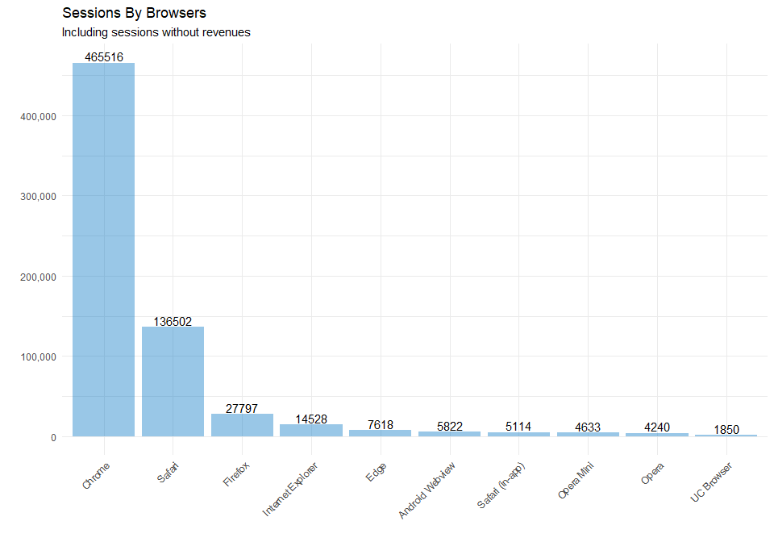<!-- -->

``` r
train_set %>% group_by(browser) %>% summarise(Count=n(), Percentage=n()/nrow(train_set) * 100, TotRev = sum(transactionRevenue)/10^6, AveRev=mean(transactionRevenue)/10^6) %>% arrange(desc(Count)) %>% head(10)
```

    ## # A tibble: 10 x 5
    ##    browser            Count Percentage    TotRev  AveRev
    ##    <fct>              <int>      <dbl>     <dbl>   <dbl>
    ##  1 Chrome            465516     68.7   1040904.  2.24   
    ##  2 Safari            136502     20.1     38186.  0.280  
    ##  3 Firefox            27797      4.10    68179.  2.45   
    ##  4 Internet Explorer  14528      2.14     3947.  0.272  
    ##  5 Edge                7618      1.12     5647.  0.741  
    ##  6 Android Webview     5822      0.859      50.9 0.00874
    ##  7 Safari (in-app)     5114      0.755     116.  0.0226 
    ##  8 Opera Mini          4633      0.684       0   0      
    ##  9 Opera               4240      0.626     119.  0.0280 
    ## 10 UC Browser          1850      0.273       0   0

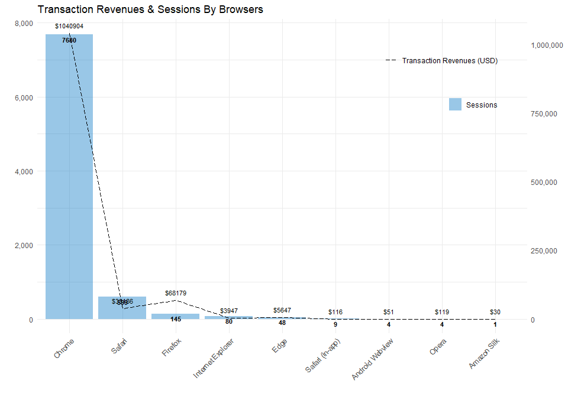<!-- -->

``` r
RP_browser
```

    ## # A tibble: 9 x 5
    ##   browser           Count Percentage    TotRev AveRev
    ##   <fct>             <int>      <dbl>     <dbl>  <dbl>
    ## 1 Chrome             7680    89.6    1040904.   136. 
    ## 2 Safari              599     6.99     38186.    63.7
    ## 3 Firefox             145     1.69     68179.   470. 
    ## 4 Internet Explorer    80     0.933     3947.    49.3
    ## 5 Edge                 48     0.560     5647.   118. 
    ## 6 Safari (in-app)       9     0.105      116.    12.9
    ## 7 Android Webview       4     0.0467      50.9   12.7
    ## 8 Opera                 4     0.0467     119.    29.7
    ## 9 Amazon Silk           1     0.0117      30.0   30.0

The first table includes all the entries including the ones with
non-zero revenues, whereas the second table contains only sessions with
positive revenues. The two tables tell us that the order of the 5 most
frequent browsers remain the same, but the order of the rest browsers
change a bit.

We can observe that the total transaction revenue from second highest
browser, Safari, is actually almost half of the total transaction
revenue from Firefox.

### Operating System

``` r
paste0("There are ", length(unique(train_set$operatingSystem)), " different operating systems in the dataset. Among the operating systems, ", length(unique(train_set$operatingSystem[revenue_positive])), " operating systems were related to transactions")
```

    ## [1] "There are 19 different operating systems in the dataset. Among the operating systems, 7 operating systems were related to transactions"

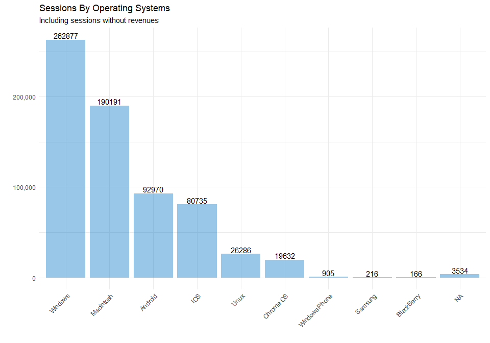<!-- -->

``` r
train_set %>% group_by(operatingSystem) %>% summarise(Count=n(), Percentage=n()/nrow(train_set) * 100, TotRev = sum(transactionRevenue)/10^6, AveRev=mean(transactionRevenue)/10^6) %>% arrange(desc(Count)) %>% head(10)
```

    ## # A tibble: 10 x 5
    ##    operatingSystem  Count Percentage   TotRev AveRev
    ##    <fct>            <int>      <dbl>    <dbl>  <dbl>
    ##  1 Windows         262877    38.8    311791.  1.19  
    ##  2 Macintosh       190191    28.1    635799.  3.34  
    ##  3 Android          92970    13.7     29049.  0.312 
    ##  4 iOS              80735    11.9     15550.  0.193 
    ##  5 Linux            26286     3.88    31034.  1.18  
    ##  6 Chrome OS        19632     2.90   133927.  6.82  
    ##  7 <NA>              3534     0.521       0   0     
    ##  8 Windows Phone      905     0.134      26.4 0.0292
    ##  9 Samsung            216     0.0319      0   0     
    ## 10 BlackBerry         166     0.0245      0   0

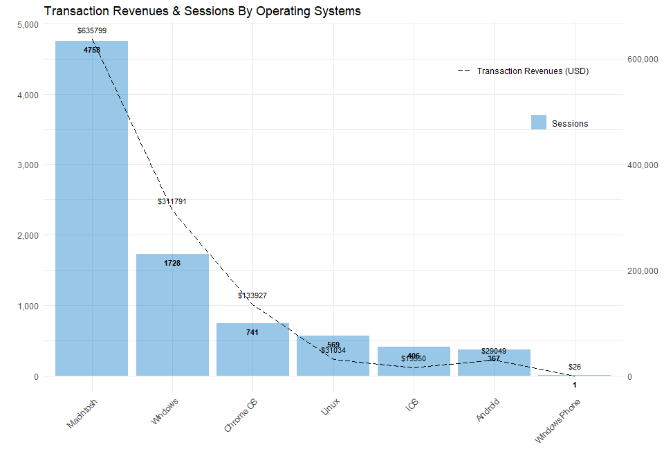<!-- -->

``` r
RP_operatingSystem
```

    ## # A tibble: 7 x 5
    ##   operatingSystem Count Percentage   TotRev AveRev
    ##   <fct>           <int>      <dbl>    <dbl>  <dbl>
    ## 1 Macintosh        4758    55.5    635799.   134. 
    ## 2 Windows          1728    20.2    311791.   180. 
    ## 3 Chrome OS         741     8.65   133927.   181. 
    ## 4 Linux             569     6.64    31034.    54.5
    ## 5 iOS               406     4.74    15550.    38.3
    ## 6 Android           367     4.28    29049.    79.2
    ## 7 Windows Phone       1     0.0117     26.4   26.4

The first table includes all the entries including the ones with
non-zero revenues, whereas the second table contains only sessions with
positive revenues. Windows and Macintosh from the first table has the
first and second highest frequency, respectively, out of 19 operating
systems. However, it is the most frequent session in the second table,
recording almost 3x higher sessions than Windows.

### Device Category

In this section, we will try to figure out whether device categories
produce a recognizable difference in terms of transaction revenues.

``` r
paste0("There are ", length(unique(train_set$deviceCategory)), " different device categories in the dataset. Among the device categories, ", 
       length(unique(train_set$deviceCategory[revenue_positive])), " device categories were related to transactions")
```

    ## [1] "There are 3 different device categories in the dataset. Among the device categories, 3 device categories were related to transactions"

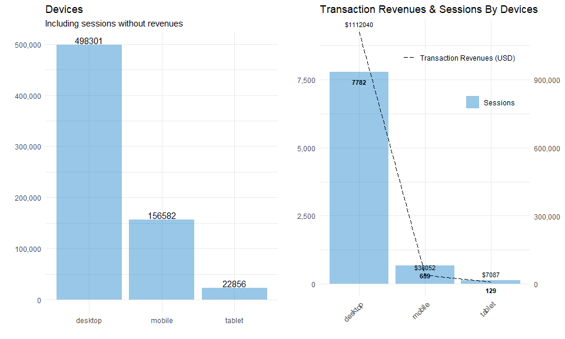<!-- -->

``` r
train_set %>% group_by(deviceCategory) %>% summarise(Count=n(), Percentage=n()/nrow(train_set) * 100, TotRev = sum(transactionRevenue)/10^6, AveRev=mean(transactionRevenue)/10^6) %>% arrange(desc(Count)) %>% head(10)
```

    ## # A tibble: 3 x 5
    ##   deviceCategory  Count Percentage   TotRev AveRev
    ##   <fct>           <int>      <dbl>    <dbl>  <dbl>
    ## 1 desktop        498301      73.5  1112040.  2.23 
    ## 2 mobile         156582      23.1    38052.  0.243
    ## 3 tablet          22856       3.37    7087.  0.310

``` r
train_set[revenue_positive, ] %>% group_by(deviceCategory) %>% summarise(Count=n(), Percentage=n()/length(revenue_positive) * 100, TotRev = sum(transactionRevenue)/10^6, AveRev=mean(transactionRevenue)/10^6) %>% arrange(desc(Count)) %>% head(10) 
```

    ## # A tibble: 3 x 5
    ##   deviceCategory Count Percentage   TotRev AveRev
    ##   <fct>          <int>      <dbl>    <dbl>  <dbl>
    ## 1 desktop         7782      90.8  1112040.  143. 
    ## 2 mobile           659       7.69   38052.   57.7
    ## 3 tablet           129       1.51    7087.   54.9

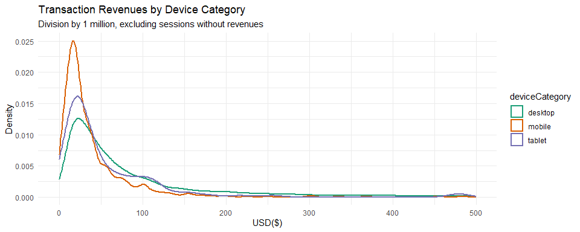<!-- --> This feature
basically contains all the information that the feature ‘isMobile’
provides (isMobile is comprised of logical values, true or false. If a
user accesses with a mobile device such as mobile phone or tablet, the
value is true, and vice versa.)

``` r
table(train_set$isMobile, useNA = 'ifany') / nrow(train_set)
```

    ## 
    ##     FALSE      TRUE 
    ## 0.7353008 0.2646992

``` r
table(train_set$isMobile[revenue_positive], useNA = 'ifany') / length(revenue_positive)
```

    ## 
    ##      FALSE       TRUE 
    ## 0.90805134 0.09194866

So we will drop ‘isMobile’ to make our model less complicated.

``` r
train_set$isMobile <- NULL
test_set$isMobile <- NULL
```

### Continent

``` r
paste0("There are ", length(unique(train_set$continent)), " different continents in the dataset. Among the continents, there were transactions in ", length(unique(train_set$continent[revenue_positive])), " continents")
```

    ## [1] "There are 6 different continents in the dataset. Among the continents, there were transactions in 6 continents"

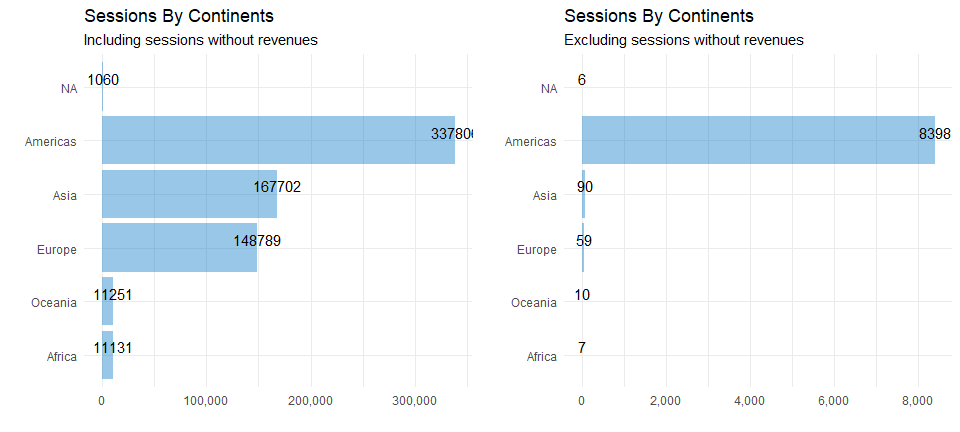<!-- -->

While other continents than America have accessed to the site quite many
times, the number of sessions that had actual transactions is almost
negligible. For example, there were 167702 sessions in Asia, but only
0.05% (=90/167702) of them had revenues.

    ## # A tibble: 6 x 5
    ##   continent Count Percentage   TotRev AveRev
    ##   <fct>     <int>      <dbl>    <dbl>  <dbl>
    ## 1 Americas   8398    98.0    1128082.  134. 
    ## 2 Asia         90     1.05     14849.  165. 
    ## 3 Europe       59     0.688     5329.   90.3
    ## 4 Oceania      10     0.117     1460.  146. 
    ## 5 Africa        7     0.0817    6688.  955. 
    ## 6 <NA>          6     0.0700     770.  128.

### Country

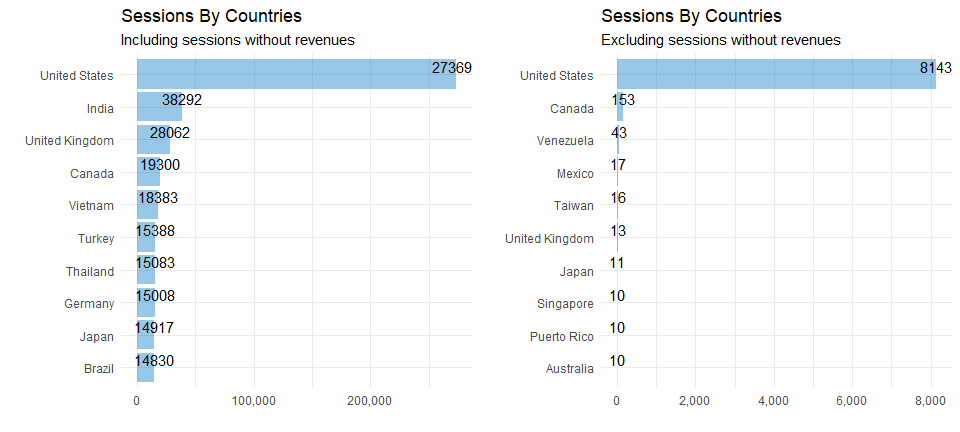<!-- -->

The two plots above tell us that India has the second highest sessions
out of 221 countries. However, the country does not generate expenses.

``` r
train_set[revenue_positive, ] %>% group_by(country) %>% summarise(Count=n(), Percentage=n()/length(revenue_positive), AveRev=mean(transactionRevenue)/10^6) %>% arrange(desc(Percentage)) %>% head(10)
```

    ## # A tibble: 10 x 4
    ##    country        Count Percentage AveRev
    ##    <chr>          <int>      <dbl>  <dbl>
    ##  1 United States   8143    0.950    134. 
    ##  2 Canada           153    0.0179   164. 
    ##  3 Venezuela         43    0.00502  185. 
    ##  4 Mexico            17    0.00198   87.4
    ##  5 Taiwan            16    0.00187  113. 
    ##  6 United Kingdom    13    0.00152  121. 
    ##  7 Japan             11    0.00128  579. 
    ##  8 Australia         10    0.00117  146. 
    ##  9 Puerto Rico       10    0.00117   68.4
    ## 10 Singapore         10    0.00117   84.3

### Hits

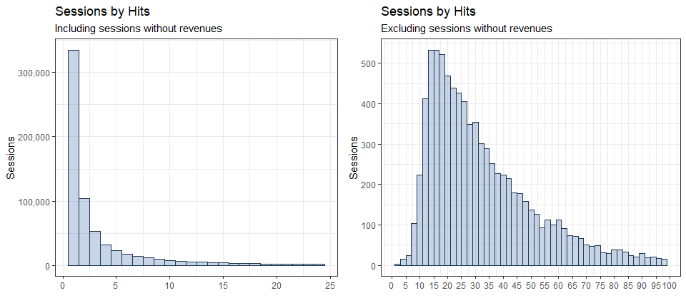<!-- --> As you can see
the plots above, they are right skewed. However, the degrees of skewness
are different. Among the sessions that had transaction revenues, the
hit==15 has the most sessions. And the number of sessions drops slowly
when the “hit” increases.

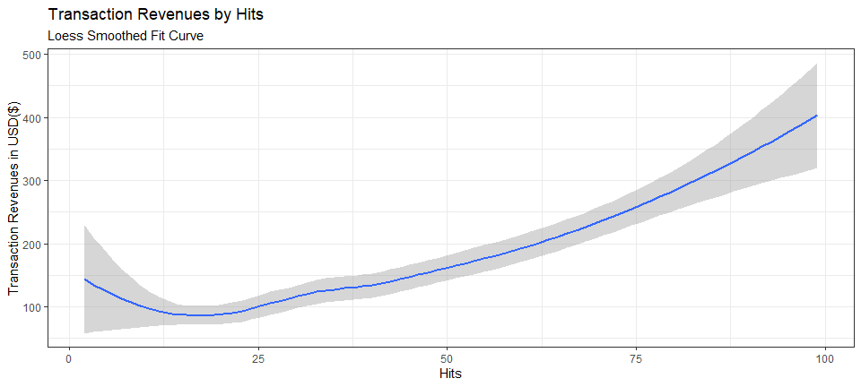<!-- --> This plot that
tells us that as the feature “hits” goes up, the transaction revenue
also increases. The higher hit indicates that a user is interacting with
the website more. So, it means that they are intereseted in the
products.

## Page Views

First, we will substitue NA with 0

``` r
pageviews_na_train <- which(is.na(train_set$pageviews==TRUE))
pageviews_na_test <- which(is.na(test_set$pageviews==TRUE))

train_set$pageviews[pageviews_na_train] <- 0
test_set$pageviews[pageviews_na_test] <- 0
```

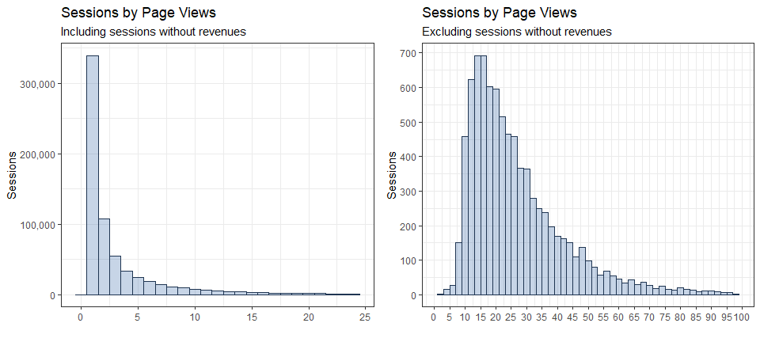<!-- -->

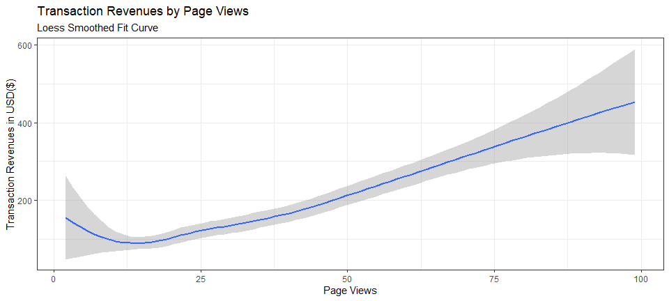<!-- --> We can see that
this feature is showing similar patterns as that of “hits”. We can
observe that the two features, hits and pageviews, not only have a very
similar distribution, but also almost identical loess smoothed fit
curves. The correlation between the two is approximately 0.98 which is
very high.

``` r
cor(train_set$hits[revenue_positive], train_set$pageviews[revenue_positive])
```

    ## [1] 0.9793897

### Bounce

We will substitute NA with 0.

``` r
train_bounces_na <- is.na(train_set$bounces)
train_set$bounces[train_bounces_na] <- 0
test_bounces_na <- is.na(test_set$bounces)
test_set$bounces[test_bounces_na] <- 0
```

Since bounce means 1-pageview, the features pageviews==1 and bounces==1
should have equal number of sessions. However, as the following two
tables show, the numbers don’t match.

``` r
bounce1 <- train_set[train_set$bounces==1, ] %>% nrow()     
pageview1 <- train_set[train_set$pageviews==1, ] %>% nrow()
paste0("The total number that website users bounced: ", bounce1, " / The total number of 1-pageview: ", pageview1)
```

    ## [1] "The total number that website users bounced: 338058 / The total number of 1-pageview: 339518"

The number of sessions that have both bounces==1 and pageviews==1 is as
follows.

``` r
which(train_set$bounces==1 & train_set$pageviews==1) %>% length()
```

    ## [1] 338058

We will convert some of data in “bounces” to 1 if the corresponding row
has pageviews==1

``` r
train_set$bounces[which(train_set$pageviews==1)] <- 1
```

And, of course, it cannot have transaction revenues when bounce==1 or
pageviews==1 because it takes at least two pages to purchase something
online.

``` r
train_set[train_set$trasactionRevenue >0 & train_set$bounces==1, ] %>% nrow()
```

    ## [1] 0

``` r
train_set[train_set$trasactionRevenue >0 & train_set$pageviews==1, ] %>% nrow()
```

    ## [1] 0

We will figure out how many sessions bounced or did not bounce, and how
many of them had transactions.

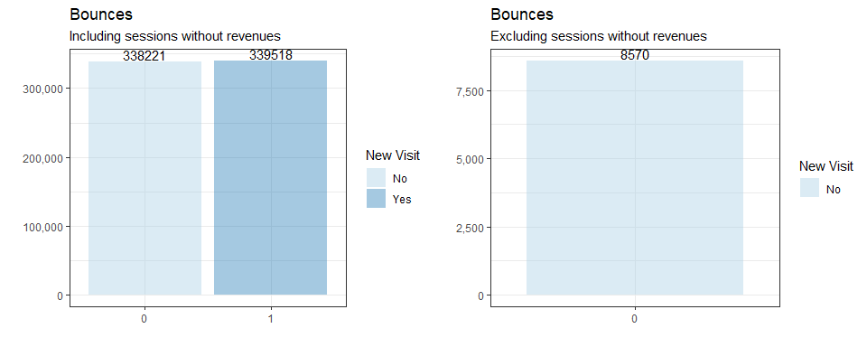<!-- -->

  - Purchase rate of a session that bounced: 0% (=0/339518)
  - Purchase rate of a session that did not bounced: 2.53%
    (=8570/338221)

### newVisits

We will substitute NA with 0.

``` r
train_newVisits_na <- is.na(train_set$newVisits)
train_set$newVisits[train_newVisits_na] <- 0
test_newVisits_na <- is.na(test_set$newVisits)
test_set$newVisits[test_newVisits_na] <- 0
```

We will figure out how many users are first time visitors or returning
visitors, and how many of the visitors purchased something.

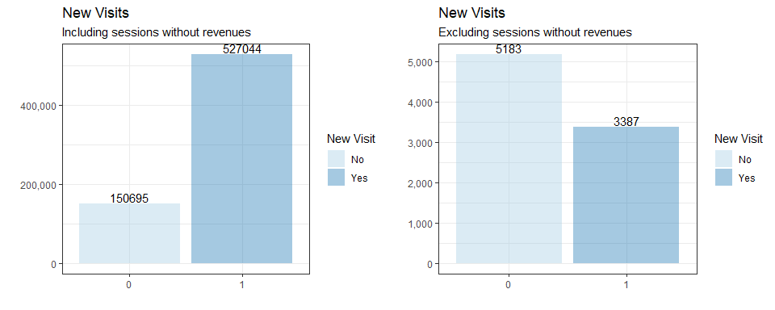<!-- -->

  - Purchase rate of a returning visitor: 3.44% (=5183/150695)
  - Purchase rate of a first time visitor: 0.64% (=3387/527044)

### Source & Medium

We are given two separate features; source and medium.

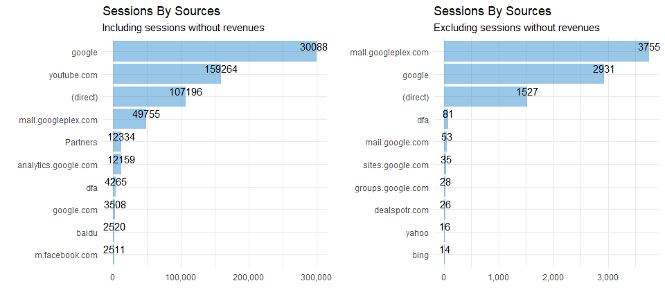<!-- -->

``` r
train_set[revenue_positive, ] %>% group_by(source) %>% summarise(Count=n(), Percentage=n()/length(revenue_positive), AveRev=mean(transactionRevenue)/10^6) %>% arrange(desc(Percentage)) %>% head(10)
```

    ## # A tibble: 10 x 4
    ##    source              Count Percentage AveRev
    ##    <chr>               <int>      <dbl>  <dbl>
    ##  1 mall.googleplex.com  3755    0.438    122. 
    ##  2 google               2931    0.342     94.7
    ##  3 (direct)             1527    0.178    219. 
    ##  4 dfa                    81    0.00945  651. 
    ##  5 mail.google.com        53    0.00618  376. 
    ##  6 sites.google.com       35    0.00408   85.1
    ##  7 groups.google.com      28    0.00327   42.5
    ##  8 dealspotr.com          26    0.00303  134. 
    ##  9 yahoo                  16    0.00187   68.5
    ## 10 bing                   14    0.00163   44.7

We can see that youtube.com has the second highest number of sessions,
but interestingly, sessions from youtube did not even make top 10 of
sessions that had transaction revenues.

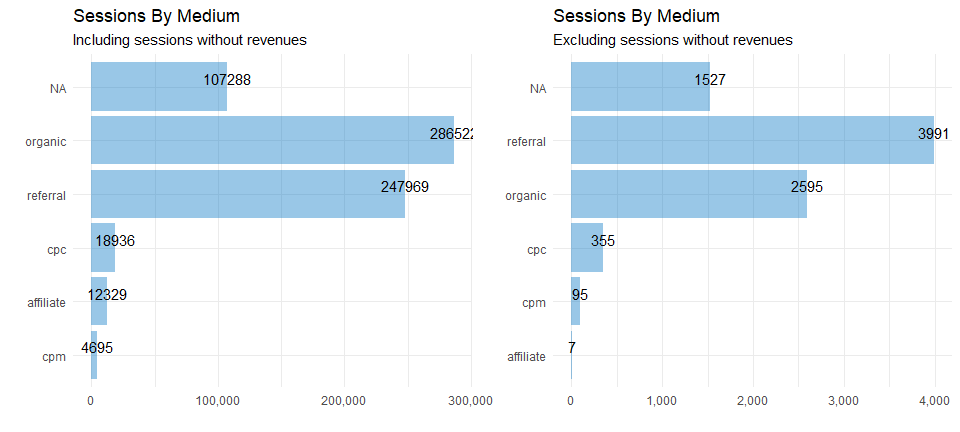<!-- -->

``` r
train_set[revenue_positive, ] %>% group_by(medium) %>% summarise(Count=n(), Percentage=n()/length(revenue_positive), AveRev=mean(transactionRevenue)/10^6) %>% arrange(desc(Percentage))
```

    ## # A tibble: 6 x 4
    ##   medium    Count Percentage AveRev
    ##   <fct>     <int>      <dbl>  <dbl>
    ## 1 referral   3991   0.466     123. 
    ## 2 organic    2595   0.303      95.0
    ## 3 <NA>       1527   0.178     219. 
    ## 4 cpc         355   0.0414     89.6
    ## 5 cpm          95   0.0111    566. 
    ## 6 affiliate     7   0.000817   74.7

### isTrueDirect

We will substitute NA with FALSE.

``` r
train_isTrueDirect_na <- is.na(train_set$isTrueDirect)
train_set$isTrueDirect[train_isTrueDirect_na] <- 0
test_isTrueDirect_na <- is.na(test_set$isTrueDirect)
test_set$isTrueDirect[test_isTrueDirect_na] <- 0
```

Convert this feature to a character variable temporarily to make a
barplot

``` r
train_set %<>% mutate(isTrueDirect = as.character(isTrueDirect))
test_set %<>% mutate(isTrueDirect = as.character(isTrueDirect))
```

We will figure out how many users accessed the site directly, and how
many of them purchased something.

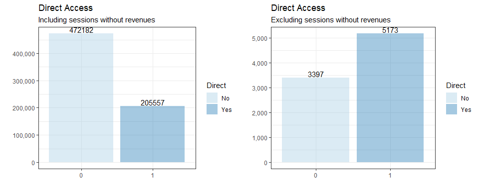<!-- -->

  - Purchase rate of a visitor with direct access: 2.52% (=5173/205557)
  - Purchase rate of a visitor with indirect access: 0.72%
    (=3397/472182)

### Referral Paths

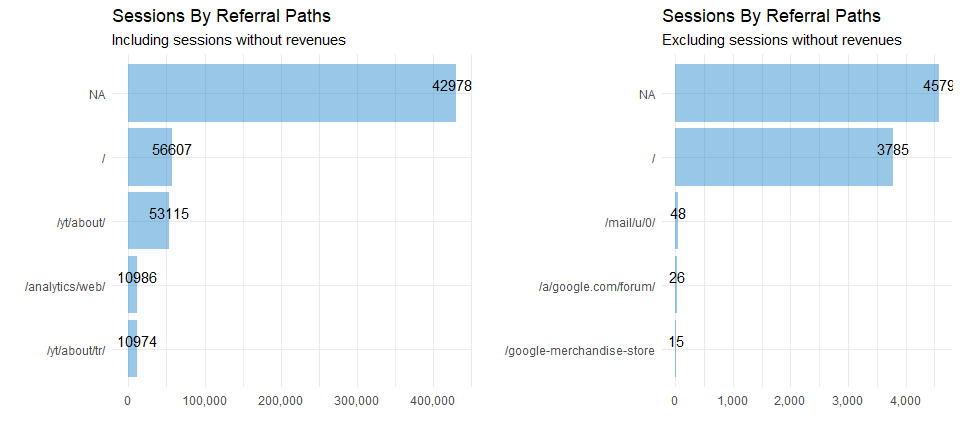<!-- -->

``` r
train_set[revenue_positive, ] %>% group_by(referralPath) %>% summarise(Count=n(), Percentage=n()/length(revenue_positive), AveRev=mean(transactionRevenue)/10^6) %>% arrange(desc(Percentage)) %>% head(10)
```

    ## # A tibble: 10 x 4
    ##    referralPath                                          Count Percentage AveRev
    ##    <chr>                                                 <int>      <dbl>  <dbl>
    ##  1 <NA>                                                   4579   0.534     146. 
    ##  2 /                                                      3785   0.442     121. 
    ##  3 /mail/u/0/                                               48   0.00560   409. 
    ##  4 /a/google.com/forum/                                     26   0.00303    43.4
    ##  5 /google-merchandise-store                                15   0.00175    97.9
    ##  6 /offer/2145                                              13   0.00152   116. 
    ##  7 /deal/-ds-sign-up-for-google-merchandise-store-email~    10   0.00117   197. 
    ##  8 /a/google.com/google-merchandise-store/on-site-store~     9   0.00105   119. 
    ##  9 /a/google.com/googletopia/discounts-deals-and-free-s~     9   0.00105    59.8
    ## 10 /a/google.com/google-merchandise-store/on-site-store      8   0.000933  106.

# 4 Data Cleaning & Feature Engineering

When predicting transaction revenues, user ID’s are useless. So we are
going to drop the following three features; “fullVisitorId”,
“sessionId”, “visitId”. Also, we’ll keep the “DayoftheWeek”, “day”,
“month”, and “year” that were extracted from the “date”, and drop the
“date”. Also, the “adwordsClickInfo.isVideoAd” is comprised of FALSE
and <NA>. We will convert it to 0/1. And the “campaignCode” is useless
because all but one row from the feature is NA.

``` r
train_set %<>% select(-fullVisitorId, -sessionId, -visitId, -date, -campaignCode, -USD) 
test_set %<>% select(-fullVisitorId, -sessionId, -visitId, -date, -campaignCode, -USD)

train_AD_na <- is.na(train_set$adwordsClickInfo.isVideoAd)
train_set$adwordsClickInfo.isVideoAd[train_AD_na] <- TRUE
test_AD_na <- is.na(test_set$adwordsClickInfo.isVideoAd)
test_set$adwordsClickInfo.isVideoAd[test_AD_na] <- TRUE
train_set %<>% mutate(adwordsClickInfo.isVideoAd = ifelse(adwordsClickInfo.isVideoAd, 1, 0))
test_set %<>% mutate(adwordsClickInfo.isVideoAd = ifelse(adwordsClickInfo.isVideoAd, 1, 0))

train_set %<>% mutate(transactionRevenue = log1p(transactionRevenue))
test_set %<>% mutate(transactionRevenue = log1p(transactionRevenue))
```

Convert character variables to factor variables and check which features
are factor variables.

``` r
train_set %<>% mutate_if(is.character, factor) %>% mutate(adwordsClickInfo.isVideoAd=factor(adwordsClickInfo.isVideoAd), day=factor(day), year=factor(year))

test_set %<>% mutate_if(is.character, factor) %>% mutate(adwordsClickInfo.isVideoAd=factor(adwordsClickInfo.isVideoAd), day=factor(day), year=factor(year))


factor_variables <- names(train_set)[sapply(train_set, class) == "factor"]
factor_variables
```

    ##  [1] "channelGrouping"                "browser"                       
    ##  [3] "operatingSystem"                "deviceCategory"                
    ##  [5] "continent"                      "subContinent"                  
    ##  [7] "country"                        "region"                        
    ##  [9] "metro"                          "city"                          
    ## [11] "networkDomain"                  "bounces"                       
    ## [13] "newVisits"                      "campaign"                      
    ## [15] "source"                         "medium"                        
    ## [17] "keyword"                        "isTrueDirect"                  
    ## [19] "referralPath"                   "adContent"                     
    ## [21] "adwordsClickInfo.page"          "adwordsClickInfo.slot"         
    ## [23] "adwordsClickInfo.gclId"         "adwordsClickInfo.adNetworkType"
    ## [25] "adwordsClickInfo.isVideoAd"     "day"                           
    ## [27] "year"

We will lump all the infrequent levels (less than 1%: approximately 6700
in train set) into one factor, “other”. We will only keep “n” levels.

``` r
train_set %<>% mutate(browser=fct_lump(browser, n=5), 
                      operatingSystem=fct_lump(operatingSystem, n=6), 
                      subContinent=fct_lump(subContinent, n=12), 
                      country=fct_lump(country, n=21), 
                      region=fct_lump(region, n=5), 
                      metro=fct_lump(metro, n=5), 
                      city=fct_lump(city, n=8),
                      networkDomain=fct_lump(networkDomain, n=6),
                      campaign=fct_lump(campaign, n=4),
                      source=fct_lump(source, n=6),
                      keyword=fct_lump(keyword, n=2),
                      referralPath=fct_lump(referralPath, n=10),
                      adContent=fct_lump(adContent, n=1),
                      adwordsClickInfo.page=fct_lump(adwordsClickInfo.page, n=2),
                      adwordsClickInfo.gclId=fct_lump(adwordsClickInfo.gclId, n=1))

test_set %<>% mutate(browser=fct_lump(browser, n=5), 
                      operatingSystem=fct_lump(operatingSystem, n=6), 
                      subContinent=fct_lump(subContinent, n=12), 
                      country=fct_lump(country, n=21), 
                      region=fct_lump(region, n=5), 
                      metro=fct_lump(metro, n=5), 
                      city=fct_lump(city, n=8),
                      networkDomain=fct_lump(networkDomain, n=6),
                      campaign=fct_lump(campaign, n=4),
                      source=fct_lump(source, n=6),
                      keyword=fct_lump(keyword, n=2),
                      referralPath=fct_lump(referralPath, n=10),
                      adContent=fct_lump(adContent, n=1),
                      adwordsClickInfo.page=fct_lump(adwordsClickInfo.page, n=2),
                      adwordsClickInfo.gclId=fct_lump(adwordsClickInfo.gclId, n=1))
```

Create matrix - One hot encoding for factor variables

``` r
options(na.action='na.pass')
train_OHE <- sparse.model.matrix(transactionRevenue ~.-1, data=train_set)
train_label <- train_set[, "transactionRevenue"]
train_matrix_xgb <- xgb.DMatrix(data=as.matrix(train_OHE), label=train_label)

test_OHE <- sparse.model.matrix(transactionRevenue ~.-1, data=test_set)
test_label <- test_set[, "transactionRevenue"]
test_matrix_xgb <- xgb.DMatrix(data=as.matrix(test_OHE), label=test_label)
```

# 5 Model Building

### XGBoost

The general process of using XGBoost is to first find the best parameter
values and rnounds, and then use the values to build a model. One way to
find the best parameter values would be using “train” function with the
“expand.grid” function based on cross validation. However, due to the
memory limitations and general performance of my computer, I am
currently not able to perform the parameter tuning. Once I upgrade a
machine, I will come back to this and try to tune the parameter values
to increase the accuarcy of this model. So, we will use the default
parameters except for the “nrounds”. The best nrounds based on the other
default parameters.

``` r
#default parameters
param.xgb <- list(booster = "gbtree", objective = "reg:squarederror", eta=0.3, gamma=0, max_depth=6, min_child_weight=1, subsample=1, colsample_bytree=1)

xgb.crossval <- xgb.cv(params = param.xgb, data = train_matrix_xgb, nrounds = 100, nfold = 5, showsd = T, stratified = T, print.every.n = 10, early.stop.round = 20, maximize = F)
```

    ## [1]  train-rmse:1.851038+0.006552    test-rmse:1.854838+0.030413 
    ## Multiple eval metrics are present. Will use test_rmse for early stopping.
    ## Will train until test_rmse hasn't improved in 20 rounds.
    ## 
    ## [11] train-rmse:1.594047+0.004349    test-rmse:1.641866+0.019812 
    ## [21] train-rmse:1.558062+0.005252    test-rmse:1.633854+0.018414 
    ## [31] train-rmse:1.532244+0.006829    test-rmse:1.631991+0.017902 
    ## [41] train-rmse:1.510060+0.005581    test-rmse:1.631777+0.018837 
    ## [51] train-rmse:1.492071+0.007199    test-rmse:1.633478+0.019144 
    ## Stopping. Best iteration:
    ## [34] train-rmse:1.525287+0.005421    test-rmse:1.631442+0.018772

``` r
#model training using default parameters and evaluating with the test set
xgb.default <- xgb.train(params = param.xgb, data = train_matrix_xgb, nrounds = xgb.crossval$best_iteration, watchlist = list(val=test_matrix_xgb, train=train_matrix_xgb), print.every.n = 10, early.stop.round = 10, maximize = F , eval_metric = "rmse")
```

    ## [22:20:55] WARNING: amalgamation/../src/learner.cc:480: 
    ## Parameters: { early_stop_round, print_every_n } might not be used.
    ## 
    ##   This may not be accurate due to some parameters are only used in language bindings but
    ##   passed down to XGBoost core.  Or some parameters are not used but slip through this
    ##   verification. Please open an issue if you find above cases.
    ## 
    ## 
    ## [1]  val-rmse:1.878470   train-rmse:1.851675 
    ## Multiple eval metrics are present. Will use train_rmse for early stopping.
    ## Will train until train_rmse hasn't improved in 10 rounds.
    ## 
    ## [11] val-rmse:1.664365   train-rmse:1.601927 
    ## [21] val-rmse:1.661163   train-rmse:1.564887 
    ## [31] val-rmse:1.664257   train-rmse:1.540809 
    ## [34] val-rmse:1.663789   train-rmse:1.535893

Let’s find out which featuers are relatively more important in this
model.

``` r
xgb.importance(colnames(train_OHE), model = xgb.default) %>% 
  xgb.plot.importance(top_n = 25)
```

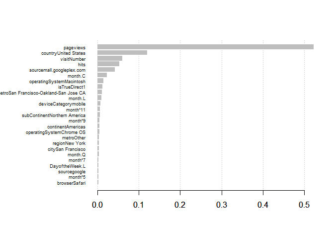<!-- -->

### LightGBM

``` r
train_ind <- train_set %>% select(-transactionRevenue)
test_ind <- test_set %>% select(-transactionRevenue)

train_matrix_lgbm = lgb.Dataset(data=as.matrix(train_ind), label=train_label, categorical_feature =factor_variables)
test_matrix_lgbm = lgb.Dataset(data=as.matrix(test_ind), label=test_label, categorical_feature =factor_variables)
```

``` r
params <- list(objective="regression",
              metric="rmse",
              learning_rate=0.01)

model <- lgb.cv(params, train_matrix_lgbm, 500, nfold = 5, min_data = 5,depth=4, leaves=10,  col_sample=0.3,eval_freq = 20, row_sample=0.5, learning_rate = 0.15, early_stopping_rounds = 10)
```

    ## [LightGBM] [Warning] Unknown parameter: col_sample
    ## [LightGBM] [Warning] Unknown parameter: leaves
    ## [LightGBM] [Warning] Unknown parameter: row_sample
    ## [LightGBM] [Warning] Unknown parameter: depth
    ## [LightGBM] [Warning] Met categorical feature which contains sparse values. Consider renumbering to consecutive integers started from zero
    ## [LightGBM] [Warning] Unknown parameter: col_sample
    ## [LightGBM] [Warning] Unknown parameter: leaves
    ## [LightGBM] [Warning] Unknown parameter: row_sample
    ## [LightGBM] [Warning] Unknown parameter: depth
    ## [LightGBM] [Warning] learning_rate is set=0.01, learning_rate=0.01 will be ignored. Current value: learning_rate=0.01
    ## [LightGBM] [Warning] Unknown parameter: col_sample
    ## [LightGBM] [Warning] Unknown parameter: leaves
    ## [LightGBM] [Warning] Unknown parameter: row_sample
    ## [LightGBM] [Warning] Unknown parameter: depth
    ## [LightGBM] [Warning] Auto-choosing row-wise multi-threading, the overhead of testing was 0.179867 seconds.
    ## You can set `force_row_wise=true` to remove the overhead.
    ## And if memory is not enough, you can set `force_col_wise=true`.
    ## [LightGBM] [Info] Total Bins 556
    ## [LightGBM] [Info] Number of data points in the train set: 542192, number of used features: 10
    ## [LightGBM] [Warning] Unknown parameter: col_sample
    ## [LightGBM] [Warning] Unknown parameter: leaves
    ## [LightGBM] [Warning] Unknown parameter: row_sample
    ## [LightGBM] [Warning] Unknown parameter: depth
    ## [LightGBM] [Warning] Unknown parameter: col_sample
    ## [LightGBM] [Warning] Unknown parameter: leaves
    ## [LightGBM] [Warning] Unknown parameter: row_sample
    ## [LightGBM] [Warning] Unknown parameter: depth
    ## [LightGBM] [Warning] learning_rate is set=0.01, learning_rate=0.01 will be ignored. Current value: learning_rate=0.01
    ## [LightGBM] [Warning] Unknown parameter: col_sample
    ## [LightGBM] [Warning] Unknown parameter: leaves
    ## [LightGBM] [Warning] Unknown parameter: row_sample
    ## [LightGBM] [Warning] Unknown parameter: depth
    ## [LightGBM] [Warning] Auto-choosing row-wise multi-threading, the overhead of testing was 0.084197 seconds.
    ## You can set `force_row_wise=true` to remove the overhead.
    ## And if memory is not enough, you can set `force_col_wise=true`.
    ## [LightGBM] [Info] Total Bins 556
    ## [LightGBM] [Info] Number of data points in the train set: 542191, number of used features: 10
    ## [LightGBM] [Warning] Unknown parameter: col_sample
    ## [LightGBM] [Warning] Unknown parameter: leaves
    ## [LightGBM] [Warning] Unknown parameter: row_sample
    ## [LightGBM] [Warning] Unknown parameter: depth
    ## [LightGBM] [Warning] Unknown parameter: col_sample
    ## [LightGBM] [Warning] Unknown parameter: leaves
    ## [LightGBM] [Warning] Unknown parameter: row_sample
    ## [LightGBM] [Warning] Unknown parameter: depth
    ## [LightGBM] [Warning] learning_rate is set=0.01, learning_rate=0.01 will be ignored. Current value: learning_rate=0.01
    ## [LightGBM] [Warning] Unknown parameter: col_sample
    ## [LightGBM] [Warning] Unknown parameter: leaves
    ## [LightGBM] [Warning] Unknown parameter: row_sample
    ## [LightGBM] [Warning] Unknown parameter: depth
    ## [LightGBM] [Warning] Auto-choosing col-wise multi-threading, the overhead of testing was 0.185025 seconds.
    ## You can set `force_col_wise=true` to remove the overhead.
    ## [LightGBM] [Info] Total Bins 556
    ## [LightGBM] [Info] Number of data points in the train set: 542191, number of used features: 10
    ## [LightGBM] [Warning] Unknown parameter: col_sample
    ## [LightGBM] [Warning] Unknown parameter: leaves
    ## [LightGBM] [Warning] Unknown parameter: row_sample
    ## [LightGBM] [Warning] Unknown parameter: depth
    ## [LightGBM] [Warning] Unknown parameter: col_sample
    ## [LightGBM] [Warning] Unknown parameter: leaves
    ## [LightGBM] [Warning] Unknown parameter: row_sample
    ## [LightGBM] [Warning] Unknown parameter: depth
    ## [LightGBM] [Warning] learning_rate is set=0.01, learning_rate=0.01 will be ignored. Current value: learning_rate=0.01
    ## [LightGBM] [Warning] Unknown parameter: col_sample
    ## [LightGBM] [Warning] Unknown parameter: leaves
    ## [LightGBM] [Warning] Unknown parameter: row_sample
    ## [LightGBM] [Warning] Unknown parameter: depth
    ## [LightGBM] [Warning] Auto-choosing row-wise multi-threading, the overhead of testing was 0.063612 seconds.
    ## You can set `force_row_wise=true` to remove the overhead.
    ## And if memory is not enough, you can set `force_col_wise=true`.
    ## [LightGBM] [Info] Total Bins 556
    ## [LightGBM] [Info] Number of data points in the train set: 542191, number of used features: 10
    ## [LightGBM] [Warning] Unknown parameter: col_sample
    ## [LightGBM] [Warning] Unknown parameter: leaves
    ## [LightGBM] [Warning] Unknown parameter: row_sample
    ## [LightGBM] [Warning] Unknown parameter: depth
    ## [LightGBM] [Warning] Unknown parameter: col_sample
    ## [LightGBM] [Warning] Unknown parameter: leaves
    ## [LightGBM] [Warning] Unknown parameter: row_sample
    ## [LightGBM] [Warning] Unknown parameter: depth
    ## [LightGBM] [Warning] learning_rate is set=0.01, learning_rate=0.01 will be ignored. Current value: learning_rate=0.01
    ## [LightGBM] [Warning] Unknown parameter: col_sample
    ## [LightGBM] [Warning] Unknown parameter: leaves
    ## [LightGBM] [Warning] Unknown parameter: row_sample
    ## [LightGBM] [Warning] Unknown parameter: depth
    ## [LightGBM] [Warning] Auto-choosing row-wise multi-threading, the overhead of testing was 0.048250 seconds.
    ## You can set `force_row_wise=true` to remove the overhead.
    ## And if memory is not enough, you can set `force_col_wise=true`.
    ## [LightGBM] [Info] Total Bins 556
    ## [LightGBM] [Info] Number of data points in the train set: 542191, number of used features: 10
    ## [LightGBM] [Warning] Unknown parameter: col_sample
    ## [LightGBM] [Warning] Unknown parameter: leaves
    ## [LightGBM] [Warning] Unknown parameter: row_sample
    ## [LightGBM] [Warning] Unknown parameter: depth
    ## [LightGBM] [Info] Start training from score 0.226608
    ## [LightGBM] [Info] Start training from score 0.226294
    ## [LightGBM] [Info] Start training from score 0.226548
    ## [LightGBM] [Info] Start training from score 0.224440
    ## [LightGBM] [Info] Start training from score 0.222976
    ## [1]: valid's rmse:1.99122+0.0253565 
    ## [21]:    valid's rmse:1.91336+0.024298 
    ## [41]:    valid's rmse:1.85903+0.0230409 
    ## [61]:    valid's rmse:1.82101+0.0218758 
    ## [81]:    valid's rmse:1.79472+0.020847 
    ## [101]:   valid's rmse:1.77625+0.0199005 
    ## [121]:   valid's rmse:1.76323+0.019142 
    ## [141]:   valid's rmse:1.75423+0.018421 
    ## [161]:   valid's rmse:1.74792+0.0176572 
    ## [181]:   valid's rmse:1.74336+0.0170291 
    ## [201]:   valid's rmse:1.74003+0.0164821 
    ## [221]:   valid's rmse:1.73767+0.0160772 
    ## [241]:   valid's rmse:1.73594+0.015746 
    ## [261]:   valid's rmse:1.73435+0.0154971 
    ## [281]:   valid's rmse:1.73291+0.0152053 
    ## [301]:   valid's rmse:1.73181+0.0150112 
    ## [321]:   valid's rmse:1.73095+0.0148309 
    ## [341]:   valid's rmse:1.73017+0.0148069 
    ## [361]:   valid's rmse:1.7296+0.0148316 
    ## [381]:   valid's rmse:1.72919+0.0148243 
    ## [401]:   valid's rmse:1.72889+0.0147891 
    ## [421]:   valid's rmse:1.72857+0.0148342 
    ## [441]:   valid's rmse:1.72831+0.0147852 
    ## [461]:   valid's rmse:1.72811+0.0148065 
    ## [481]:   valid's rmse:1.72799+0.0148103 
    ## [500]:   valid's rmse:1.72794+0.0148693

``` r
params <- list(objective="regression",
              metric="rmse",
              learning_rate=0.01)

lgb.model <- lgb.train(params = params,
                       data = train_matrix_lgbm,
                       valids = list(train=train_matrix_lgbm, valid=test_matrix_lgbm),
                       learning_rate=0.01,
                       nrounds=1000,
                       verbose=1,
                       early_stopping_rounds=50,
                       eval_freq=100
                      )
```

    ## [LightGBM] [Warning] Unknown parameter: col_sample
    ## [LightGBM] [Warning] Unknown parameter: leaves
    ## [LightGBM] [Warning] Unknown parameter: row_sample
    ## [LightGBM] [Warning] Unknown parameter: depth
    ## [LightGBM] [Warning] learning_rate is set=0.01, learning_rate=0.01 will be ignored. Current value: learning_rate=0.01
    ## [LightGBM] [Warning] learning_rate is set=0.01, learning_rate=0.01 will be ignored. Current value: learning_rate=0.01
    ## [LightGBM] [Warning] Auto-choosing row-wise multi-threading, the overhead of testing was 0.033912 seconds.
    ## You can set `force_row_wise=true` to remove the overhead.
    ## And if memory is not enough, you can set `force_col_wise=true`.
    ## [LightGBM] [Info] Total Bins 556
    ## [LightGBM] [Info] Number of data points in the train set: 677739, number of used features: 10
    ## [LightGBM] [Info] Start training from score 0.225373
    ## [1]: train's rmse:1.99129    valid's rmse:2.02168 
    ## [101]:   train's rmse:1.76456    valid's rmse:1.79988 
    ## [201]:   train's rmse:1.71765    valid's rmse:1.76048 
    ## [301]:   train's rmse:1.69926    valid's rmse:1.75068 
    ## [401]:   train's rmse:1.68754    valid's rmse:1.74626 
    ## [501]:   train's rmse:1.67895    valid's rmse:1.74462 
    ## [601]:   train's rmse:1.67176    valid's rmse:1.74393 
    ## [701]:   train's rmse:1.6661 valid's rmse:1.74352

### Conclusion

We can see that the XGBoost model performs better than LightGBM Model.
XGBoost has lower train and validation RMSE than that LightGBM. However,
please note that once I upgrade my machine, I will try to optimize the
models by tuning parameters and then compare their performances again.
