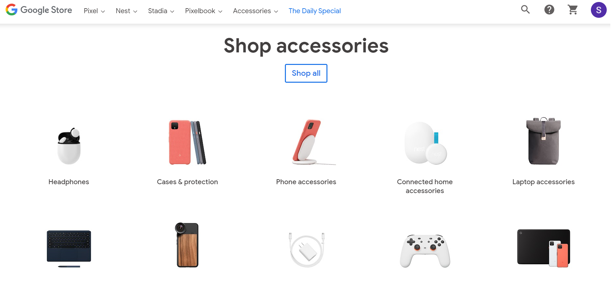
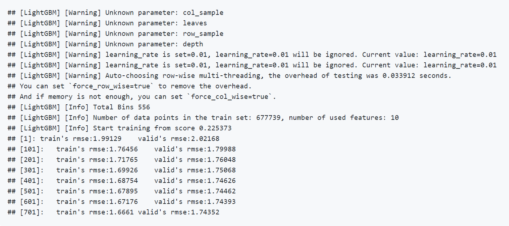
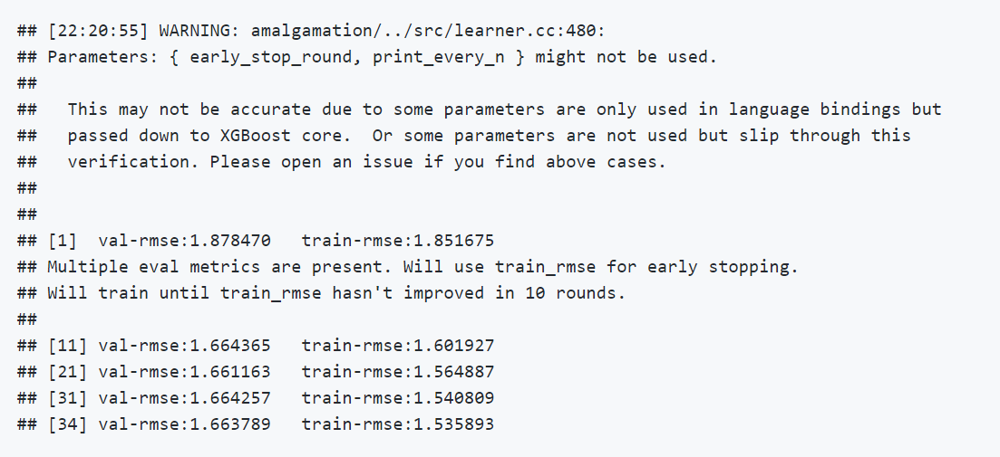
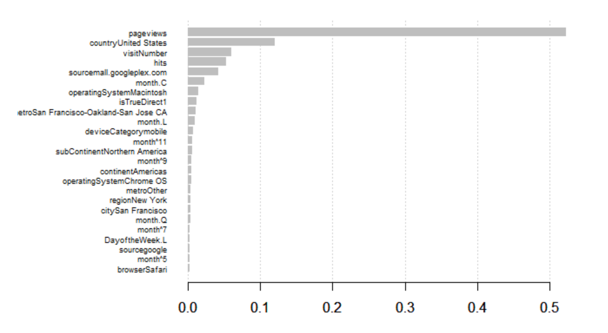

Google Store Transaction Revenue Prediction
================

> Exploring Google Store data set and building models to predict
> transaction revenues

### Introduction

As we all know, Google is one of the biggest tech giants. They
specialize in internet-related services, and people all around the world
use them on a daily basis. Having billions of active users allows them
to accumulate massive data, which plays a critical role of further
developing their businesses rapidly. In addition to internet-related
services, Google operates Google Store (GStore in short) which is an
online retailer that sells not only hardwares including phones,
Chromecasts, and speakers, but also accessories such as chargers,
earbuds, etc. You can explore GStore [here](https://store.google.com/).

This is how Google Store looks like:

In business, knowing your company’s future revenue in advance is
essential to success. [This
article](https://fullyaccountable.com/8-benefits-forecasting-revenue/)
introduces 8 advantages you will have if you predict future revenues of
your business:

1.  Brings in more investors
2.  Budgets business expenses
3.  Justifies hiring decisions
4.  Executes strategic planning
5.  Improves production scheduling
6.  Helps you know your customer better
7.  Manages cash flow and credit
8.  Contributes to sales and product analysis

Likewise, forecasting future revenues plays an essential role in
decision-making process when running a business.

-----

### Objective

In this project, I will deal with transaction revenues data provided by
Google Store. As a big fan of Google products because of their quality
and reliability, I wanted to know how other customers spending patterns
look like. And since Google is one of the leading companies in tech
industry, I wanted to see their future revenues. I will build regression
models to predict how much visitors will spend. This analysis will help
Google Store predict their future revenues and eventually generate more
revenues by achieving the above benefits. To accomplish this, I will
implement two machine learning models, XGBoost and LightGBM. Please find
more information about XGboost
[here](https://xgboost.readthedocs.io/en/latest/) and LightGBM
[here](https://lightgbm.readthedocs.io/en/latest/). You can find the
comparison of the two boosting algorithms
[here](https://medium.com/riskified-technology/xgboost-lightgbm-or-catboost-which-boosting-algorithm-should-i-use-e7fda7bb36bc).

#### About the Data

You can download the dataset used in this project
[here](https://www.kaggle.com/c/ga-customer-revenue-prediction/data).
Please note that we use the previous version of dataset (not the files
named train\_v2.csv and test\_v2.csv). - The training set is comprised
of 670k of customers’ transaction information and 55 features such as
their date they accessed Google Store and browser they used. - The
target variable is “transactionRevenue”. - Detailed descriptions of the
features can be found
[here](https://support.google.com/analytics/answer/3437719?hl=en).

#### Why use XGBoost and LightGBM for this project?

The main reason why I chose these algorithms is their training time.
Since the size of dataset we will be using is quite large, it would take
some time to train a model with traditional regression algorithms. And
another reason I am using the two algorithms is that they can handle
missing values well. The percentages of missing values in this dataset
is very high. This dataset has 55 features and 26 of them have missing
values and 10 of them have 90% or larger missing value rates. So, I
thought it would be a lot easier to train with XGBoost and LightGBM that
can handle missing values.

-----

### Conclusion

 The figure above is a result from
LightGBM model. You can see that the final outputs of train’s RMSE and
valid’s RMSE are 1.6661 and 1.74352, respectively.

 And the above figure is a result from
XGBoost. You can see that the XGBoost model performs better than
LightGBM Model. XGBoost has lower train and validation RMSE(train: 1.536
/ validation: 1.664) than that LightGBM (train: 1.666 / validation:
1.743). However, there was a significant difference in the training time
between XGBoost and LightGBM. Training time took much longer with
XGBoost than LightGBM.

 We have much more features
than the original dataset, because we performed One Hot Encoding to
categorical features. You can observe that the feature “pageviews” is
the most important feature, followed by “countryUnited States”. But
interestingly, there is a huge difference in the scores between the most
and second most important features.

Please note that due to the memory limitations and general performance
of my computer, I am currently not able to perform the parameter tuning.
Once I upgrade my machine, I will try to optimize the models by tuning
parameters and then compare their performances again.

-----

### Installation

This project builds a LightGBM model so your computer needs to have the
“lightgbm” library. Please refer to this [installation
guide](https://lightgbm.readthedocs.io/en/latest/Installation-Guide.html)
to install the library on your computer.

-----

### Versions

For this project, I use

  - R version 4.0.0
  - cmake version 3.18.1
  - Visual Studio 2019 version 16.6
  - Git version 2.28.0

-----

### Contact Information

  - If you have any questions, feel free to email me at
    <sjung.stat@gmail.com>
  - You can find my LinkedIn profile
    [here](https://www.linkedin.com/in/sjung-stat/)
